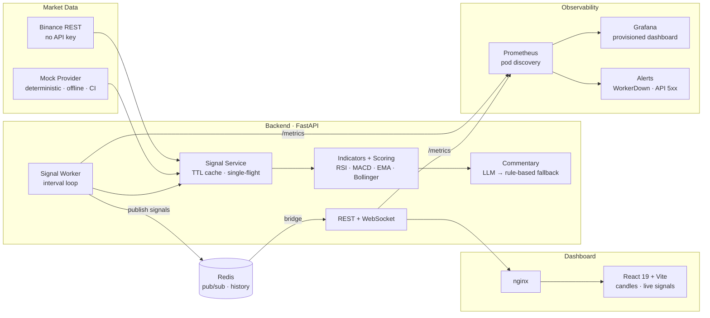

# 🤖 AI Trading Signal Platform

[](https://github.com/daniyalbadar300/ai-trading-signal-platform/actions/workflows/ci.yml)
[](https://github.com/daniyalbadar300/ai-trading-signal-platform/actions/workflows/cd.yml)

> End-to-end **AI-integrated DevOps project**: real-time crypto trading signals
> (technical indicators + LLM commentary) generated from Binance data, shipped
> through a fully automated pipeline — Docker, Kubernetes (kustomize + kind),
> GitHub Actions CI/CD, and Prometheus/Grafana monitoring.

> ⚠️ Educational/portfolio project. Not financial advice.

## Architecture



**Delivery pipeline:** every push → CI (lint + tests + kustomize validation +
**kind e2e deploy & smoke**); every push to `master` → CD (images to GHCR with
SHA tags → staging overlay deployed into a fresh kind cluster with real
registry pulls → smoke suite).

<!-- 📸 Screenshots: docs/screenshots/ me daalein —
     dashboard.png  = trading dashboard (localhost:8090)
     grafana.png    = /grafana "AI Trading Signals" dashboard
     prometheus.png = /prometheus targets page
-->

## ✨ Highlights by phase

| Phase | What was built |
|---|---|
| 1 · Backend core | Binance/Mock providers with TTL single-flight cache, pure-pandas indicators (RSI-14 Wilder, MACD 12/26/9, EMA 20/50, Bollinger 20/2σ, volume ratio), weighted composite scorer (threshold 0.15), FastAPI REST |
| 2 · AI + worker | LLM commentary (any OpenAI-compatible API) with automatic rule-based fallback, background `SignalWorker` (store → publish), `/api/v1/history`, `/api/v1/stats`, WebSocket snapshot-then-live stream |
| 3 · Dashboard | React 19 + Vite + Tailwind v4, lightweight-charts v5 candlesticks, signal cards with confidence meters, WS auto-reconnect with stale-socket guard, history table |
| 4 · Docker | Multi-stage non-root images, 5-service compose stack (backend, worker, Redis AOF, nginx frontend), cross-container worker→Redis→API→WS flow |
| 5 · Kubernetes | Kustomize base + dev/staging/prod overlays, HPA 2→6 @70% CPU, probes, non-root securityContext, Redis PVC, nginx ingress with WebSocket routing, project-local kind |
| 6 · CI/CD | GitHub Actions: 4-job CI (ruff/pytest, vitest/build, kustomize validate, kind e2e + smoke), CD (GHCR SHA-tagged publish → staging deploy with real pulls → smoke) |
| 7 · Monitoring | `prometheus-client` metrics (API + worker), Prometheus pod-discovery + alert rules, Grafana with provisioned "AI Trading Signals" dashboard, alert lifecycle live-tested |

**Quality:** 90 passing tests (82 pytest + 8 vitest) · ruff clean · JSON structured
logging with request IDs · alerts verified end-to-end (pending → resolved).

## 🚀 Quick starts

### 1. Docker Compose — full stack

```bash
make up        # backend + worker + redis + frontend
curl http://localhost:8000/api/v1/stats
# dashboard: http://localhost:5173
make down
```

### 2. Kubernetes (kind) — dev overlay

```bash
make deploy    # cluster up + images load + dev overlay + ingress-nginx
# hosts file me add karein:  127.0.0.1 trading.local
# dashboard:  http://trading.local:8090
make undeploy && make cluster-down   # cleanup
```

### 3. Monitoring — Prometheus + Grafana

```bash
make deploy         # app pehle (dev overlay)
make monitoring-up  # same cluster + shared ingress
# Grafana:    http://trading.local:8090/grafana  (anonymous viewer, dashboard preloaded)
# Prometheus: http://trading.local:8090/prometheus
make monitoring-down
```

Alerts fire when the worker dies (`absent(worker_running)` branch), when cycles
fail repeatedly, or when API 5xx rate exceeds 5%.

### 4. Guided demo

```bash
make demo    # narrated end-to-end: tests → render → deploy → live signals → monitoring
```

### 5. Local development

```bash
cd backend
python -m venv .venv
source .venv/Scripts/activate       # Windows Git Bash (Linux/Mac: .venv/bin/activate)
pip install -e ".[dev]"

DATA_PROVIDER=mock uvicorn app.main:app --reload --port 8000
DATA_PROVIDER=binance uvicorn app.main:app --reload --port 8000   # live data

python -m pytest && python -m ruff check app tests
```

```bash
cd frontend
npm install && npm run dev          # http://localhost:5173 (proxies /api + /ws → :8000)
npm test && npm run build
```

## 🔌 API

| Endpoint | Description |
|---|---|
| `GET /health` | Liveness + upstream reachability (`provider`, `upstream_ok`) |
| `GET /metrics` | Prometheus text format (gated by `METRICS_ENABLED`) |
| `GET /api/v1/symbols` | Configured watchlist |
| `GET /api/v1/candles/{symbol}?interval=1m&limit=120` | OHLCV candles (cached) |
| `GET /api/v1/signals/{symbol}` | Composite signal: action, confidence, indicators, contributions, commentary |
| `GET /api/v1/signals` | Signals for the whole watchlist |
| `GET /api/v1/history?limit=50&symbol=BTCUSDT` | Worker-generated history (newest first) |
| `GET /api/v1/stats` | Aggregate counters over stored signals |
| `GET /worker/status` | Worker loop snapshot (`cycles`, `last_error`, …) |
| `WS /ws/signals` | `{type:"snapshot"}` on connect, then `{type:"signal"}` per event |

```bash
curl http://localhost:8000/api/v1/signals/BTCUSDT
# {"symbol":"BTCUSDT","action":"BUY","confidence":0.98,"score":0.44,
#  "indicators":{"rsi_14":33.4,...},"commentary":{...,"source":"rule-engine"}}
```

## ⚙️ Configuration (env / `.env` — see `.env.example`)

| Key | Default | Purpose |
|---|---|---|
| `DATA_PROVIDER` | `binance` | `binance` (live, no key) · `mock` (deterministic offline) |
| `SYMBOLS` | `BTCUSDT,ETHUSDT,SOLUSDT` | Watchlist |
| `WORKER_INTERVAL_SECONDS` | `60` | Signal generation cadence |
| `WORKER_ENABLED` | `true` | `false` when a dedicated worker container runs |
| `REDIS_URL` | *(empty)* | Empty = in-process bus/store; set for cross-container pub/sub |
| `SIGNAL_THRESHOLD` | `0.15` | BUY/SELL trigger vs HOLD |
| `METRICS_ENABLED` | `false` | Prometheus `/metrics` + worker metrics server |
| `OPENAI_API_KEY` / `_BASE_URL` / `_MODEL` | — | Optional; works with OpenAI/Gemini/Groq/Ollama |

## 📁 Project layout

```
backend/    FastAPI app: providers · indicators · signals · AI · worker
            · store · events · redis_bus · metrics · tests (82)
frontend/   React 19 + Vite dashboard · nginx.conf · vitest (8)
infra/
  docker-compose.yml    5-service local stack
  k8s/base+overlays     kustomize: dev (mock) / staging (GHCR) / prod
  monitoring/           Prometheus + Grafana + alert rules (kustomize)
  kind-config.yaml      local cluster (hostPort 8090→80)
scripts/demo.sh          narrated end-to-end demo
.github/workflows/       ci.yml (tests + kind e2e) · cd.yml (GHCR + staging)
```

## 📚 Notes

- Deployment gotchas and hard-won lessons (RBAC + pod discovery, OCI index
  pulls on kind, PEP 621, Windows/Linux CI differences …) are recorded in
  [PROGRESS.md](PROGRESS.md) — the build log of all 8 phases.
- CI runs fully offline (`DATA_PROVIDER=mock` pinned in conftest); no secrets
  needed — the AI layer degrades gracefully to rule-based commentary.
